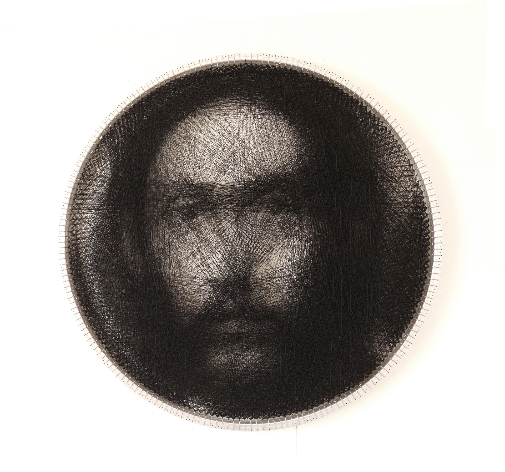

# My favorite Math Art
Some of my favorite math art (not made by me)

# Interesting primitives



```
Christ
Petros Vrellis, 2016
28" alimunum rim loom with 200 anchor pegs on its circumference. 
```
[website](http://artof01.com/vrellis/works/knit.html)

